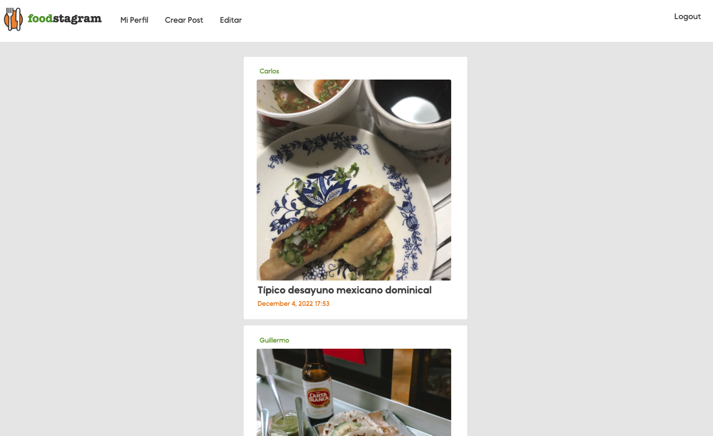
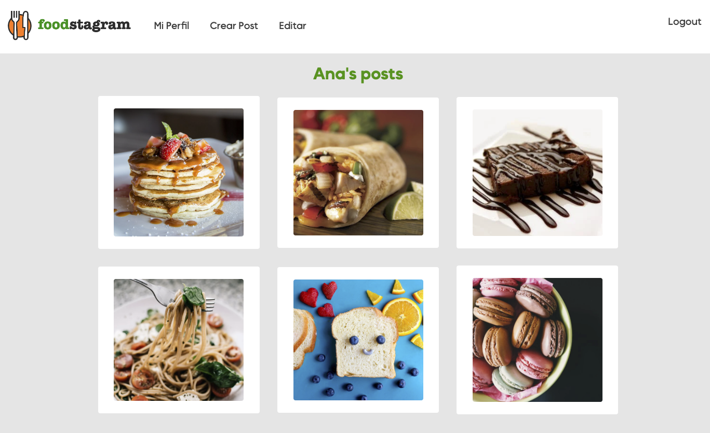
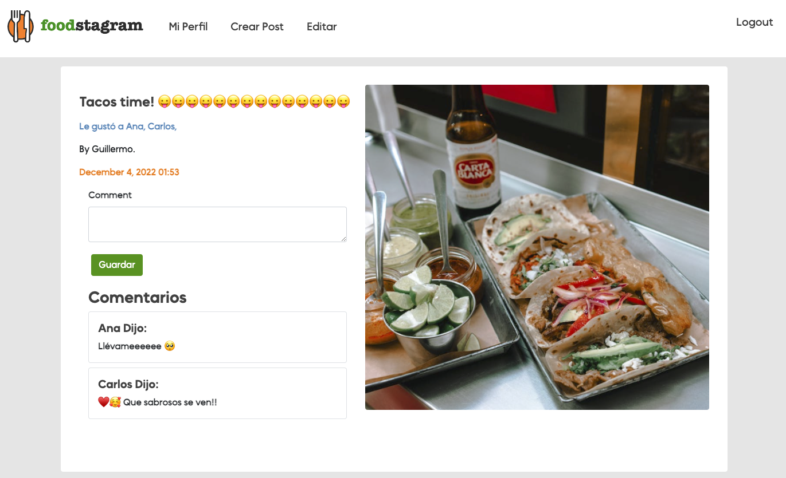
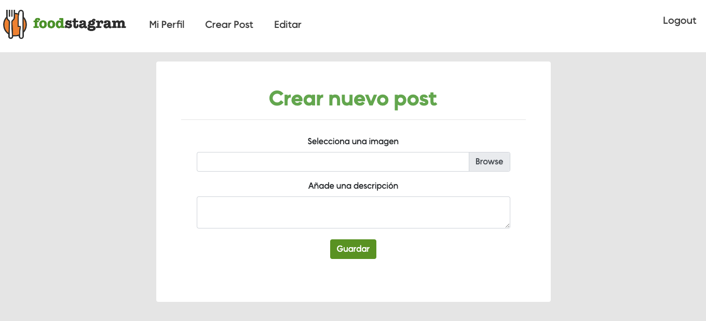
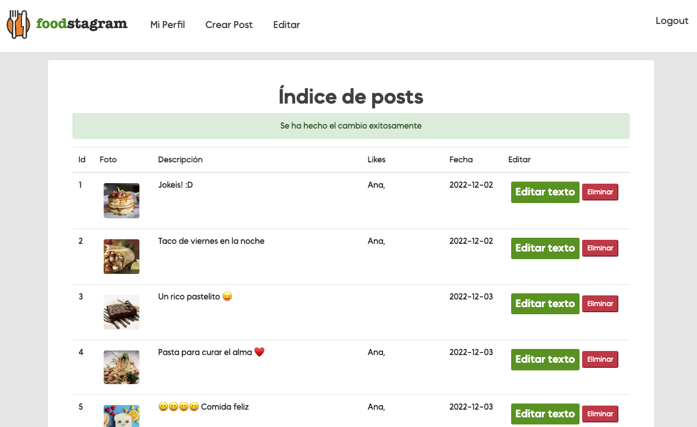
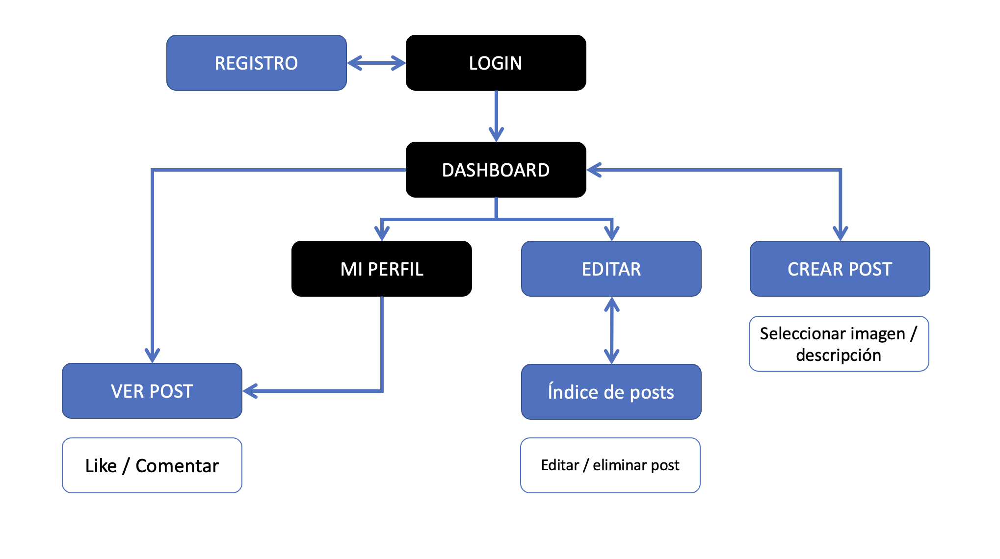
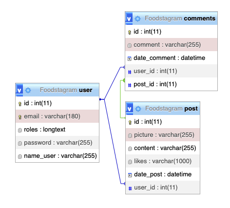

# Una plataforma para subir las fotos de tu comida favorita
Esta es una propuesta de una aplicación donde debes registrarte, loggearte y después puedes subir fotografías de comida, su descripción, poder darle like y comentar las fotos de los demás miembros de la comunidad, editar y eliminar tus publicaciones.

## !🔌 Instala dependencias:
Debes tener instalado COMPOSER una vez hayas clonado el proyecto, posteriormente ejecutar el comando:

### `composer install`
Una vez ejecutado este comando se creará la carpeta vendor la cual contiene los bundles y códigos de terceros.

Ejecútalo con:
### `symfony server:start`
______ 

## Stack utilizado

- HTML    
- CSS
- JS
- SYMFONY 5.4
- PHP 8.1
- PHPUNIT
- XAMPP

______ 
# Vistas 
______ 
### Página principal

______ 
### Perfil

______ 
### Ver Post

______ 
### Crear Post

______ 
### Editar 

______ 

## Proceso de Desarrollo

Arquitectura: 

Entidades en base de datos:

______ 
______ 

